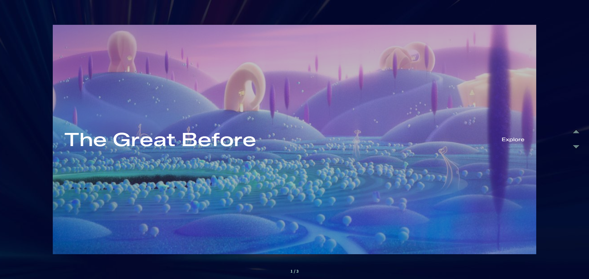

# 🎬 Vertical Lift Slideshow
> A cinematic slideshow with vertical lift transitions built with GSAP

[🔗 Live Demo](https://lift-slideshow.netlify.app/)

---

## Features
- **Clip-path Mask**: Image reveal effect using CSS clip-path
- **Smooth Transitions**: Enter/exit animations with GSAP timeline
- **Hover Interaction**: Clip-path expands on hover
- **Navigation**: Prev/Next controls with current index display
- **Directional Animation**: Slide direction reflects next/prev movement

## Tech Stack
- **GSAP** (animations)
- **JavaScript (ES6+)**
- **SCSS**
